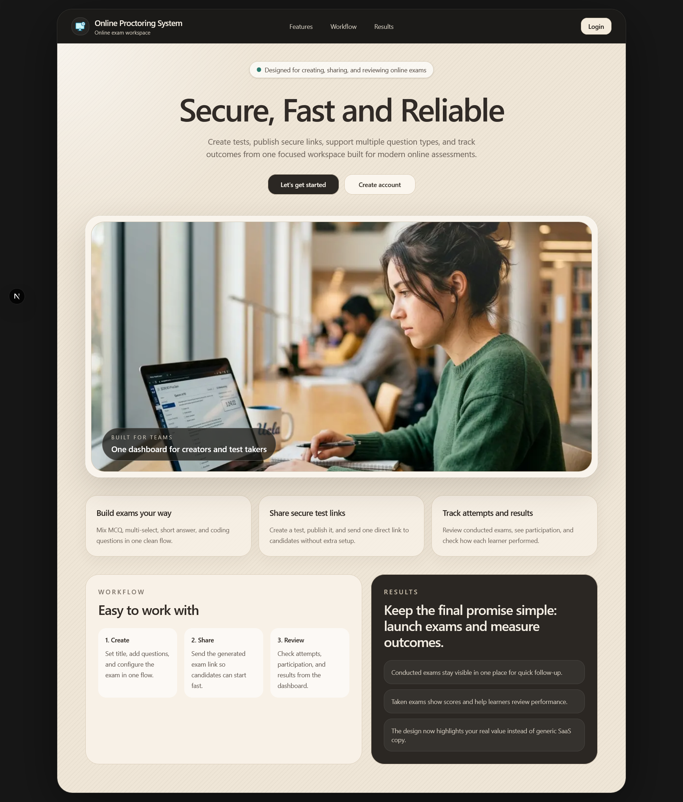

# Multiple Login - Exam Management System

A full-stack web application for creating, managing, and taking exams with secure user authentication. Built with **Spring Boot** and **Next.js**, this system allows educators to create custom exams with multiple question types and track student performance.

---

## Watch video - https://youtu.be/bXTFtT1exNQ

## 🌟 Features

- **User Authentication**: Secure login and account creation system
- **Exam Management**: Create and manage multiple exams with custom configurations
- **Question Types**: Support for various question types including MCQ, MCA, short text, and coding challenges
- **Exam Attempts**: Track student attempts and performance
- **Results Dashboard**: View detailed exam results and analytics
- **Test Settings**: Customize exam parameters and test behavior

---

## 🛠️ Tech Stack

### Backend
- **Java** with **Spring Boot**
- **Maven** for dependency management
- RESTful API architecture

### Frontend
- **Next.js** with **TypeScript**
- **React** for UI components
- **Tailwind CSS** (via shadcn/ui components)
- **Axios** for API communication

---

## 📋 Prerequisites

- **Java** 11+ installed
- **Node.js** 18+ and **npm** installed
- **Git** (optional, for version control)

---

## 🚀 Getting Started

### Backend Setup

1. Navigate to the backend directory:
   ```bash
   cd backend
   ```

2. Build the project:
   ```bash
   mvn clean install
   ```

3. Run the Spring Boot application:
   ```bash
   mvn spring-boot:run
   ```
   The backend will start on `http://localhost:8080`

### Frontend Setup

1. Navigate to the frontend directory:
   ```bash
   cd frontend
   ```

2. Install dependencies:
   ```bash
   npm install
   ```

3. Create a `.env.local` file (if needed) with API configuration:
   ```
   NEXT_PUBLIC_API_URL=http://localhost:8080
   ```

4. Run the development server:
   ```bash
   npm run dev
   ```
   The frontend will start on `http://localhost:3000`

---

## 📁 Project Structure

```
├── backend/          # Spring Boot backend API
│   └── src/main/java/com/example/backend/
│       ├── controller/    # REST API endpoints
│       ├── service/       # Business logic
│       ├── dto/           # Data transfer objects
│       ├── entity/        # Database entities
│       └── repository/    # Database access layer
│
└── frontend/         # Next.js frontend application
    └── app/
        ├── login/          # User authentication pages
        ├── create-acc/     # Account creation
        ├── create-exam/    # Exam creation interface
        ├── dashboard/      # Main dashboard
        ├── attempt/        # Exam attempt pages
        └── components/     # Reusable React components
```

---

## 📸 Screenshots



---

## 🤝 Contributing

Contributions are welcome! To contribute:

1. Fork the repository
2. Create a feature branch (`git checkout -b feature/amazing-feature`)
3. Commit your changes (`git commit -m 'Add amazing feature'`)
4. Push to the branch (`git push origin feature/amazing-feature`)
5. Open a Pull Request

---

## 📝 License

This project is open source and available under the MIT License.

---

## ❓ Support

For questions or issues, please create an issue in the repository.
